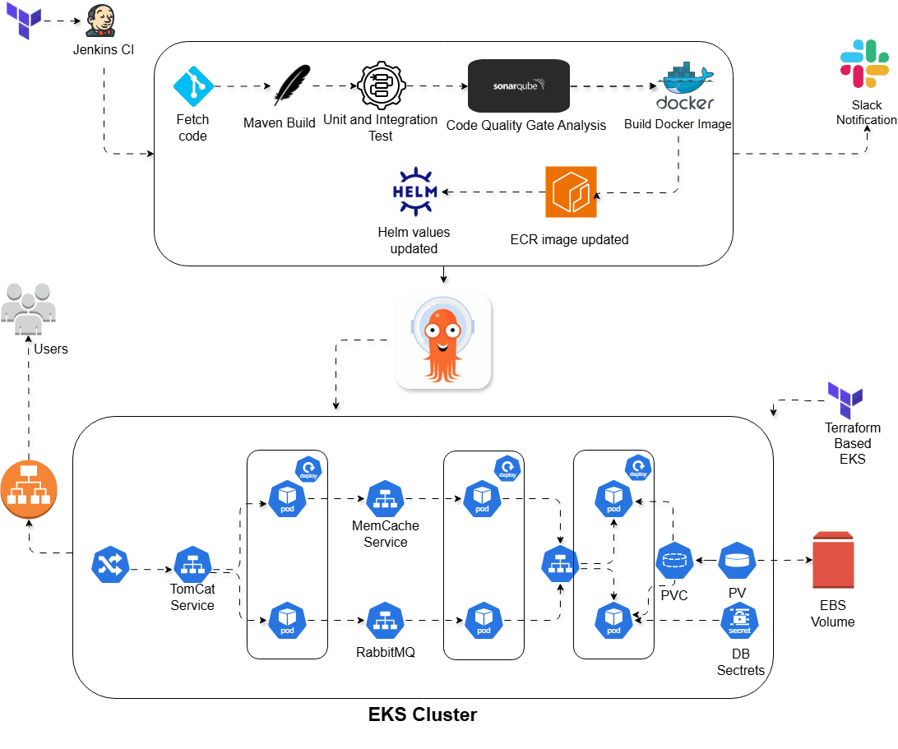

# WebApp Infrastructure

## Overview

This repository contains infrastructure and deployment artifacts for VProfile. It is focused on local infrastructure setup, container orchestration, and provisioning scripts rather than Java application build instructions.

Components covered here:
- Docker Compose services
- Kubernetes manifests
- Helm chart
- Jenkins / Nexus / SonarQube provisioning scripts
- Vagrant provisioning configurations

## Local Setup — Minimal Steps

### 1. Prerequisites

- Docker installed
- Docker Compose support (`docker compose` or `docker-compose`)
- Optional for Kubernetes: `kubectl`, `helm`, and a local cluster provider such as `kind`, `minikube`, or `k3d`

### 2. Run with Docker Compose

From the repository root:

    docker compose up -d

Verify the services:

    docker compose ps

Stop and remove containers:

    docker compose down

This Compose stack uses local build contexts in `Docker-files/db`, `Docker-files/app`, and `Docker-files/web`.

### 3. Run with Kubernetes manifests

If you want a local Kubernetes deployment, ensure your cluster is running and then apply the manifests:

    kubectl apply -f kubernets_manifest/

Check the deployed resources:

    kubectl get pods,svc -A

If you need to remove the deployment:

    kubectl delete -f kubernets_manifest/

### 4. Run with Helm

Install or upgrade the chart from `helm/`:

    helm upgrade --install vprofile ./helm -f ./helm/values.yaml

Verify the Helm release:

    helm list
    kubectl get all -A

Remove the release:

    helm uninstall vprofile

## Key Files and Directories

- `docker-compose.yaml` — local Docker Compose deployment definition
- `Docker-files/` — Docker build contexts for database, application, and web components
- `kubernets_manifest/` — Kubernetes YAML manifests for deployment, services, PVCs, and secrets
- `helm/` — Helm chart for the VProfile deployment
- `Jenkinsfile` — CI/CD pipeline definition
- `userdata/jenkins-setup.sh` — Jenkins provisioning script
- `userdata/nexus-setup.sh` — Nexus repository provisioning script
- `userdata/sonar-setup.sh` — SonarQube provisioning script
- `vagrant/` — VM provisioning configurations and helper scripts

## Provisioning Scripts

Use these scripts for infrastructure provisioning on a target VM or server:

- `userdata/jenkins-setup.sh`
- `userdata/nexus-setup.sh`
- `userdata/sonar-setup.sh`

## Notes

- This README is intentionally infrastructure-focused and does not provide Java application build or runtime instructions.
- For local infra validation, Docker Compose is the quickest path.
- Kubernetes and Helm manifests are included for cluster-based deployment.

